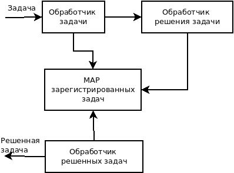

Финальный проект курса обучения Яндекса программированию на языке Go.  
Выполнил Андрей Саперов телеграм: @AndreySaperov  
Часть вторая. Агент.  
Клонируем в отдельную папку проект  
git clone https://github.com/developerc/finprojagent3.git  
Переходим в папку  
cd finprojagent3  
Создаем исполняемый файл  
go build  
Перед первым запуском агента подготовим настроечный файл settings.txt который должен лежать рядом с исполняемым файлом. 
При запуске приложения оно читает из файла настройки: первая строка для оркестратора, вторая для агента. 
gRPC сервер оркестратора запускается по умолчанию на порту 5000. Порт агента должен отличаться, например первого агента 
можно запустить на порту 5001, второго на 5002 и т.д. Для запуска нескольких агентов скопировать исполняемый файл в разные 
папки, положить рядом настроечный файл, изменить номер порта. Первым запускать оркестратор, потом агенты по очереди. 
Для вычисления математического выражения использую библиотеку "github.com/dengsgo/math-engine/engine" которая вычисляет 
все основные арифметические операции.  
Для обмена сообщениями используется протокол gRPC. На стороне агента запускается сервер для приема сообщений от оркестратора. 
Агент так же подключается к серверу оркестратора.  
Разработаны модульные тесты для проверки работы основных функций.  
Схема работы агента.  
  
На схеме показан путь задачи в процессе приема и решения.  
По протоколу gRPC JSON сообщение с задачей приходит агенту и принимается обработчиком задачи. Он проверяет MAP зарегистрированных задач. Если количество задач находящихся в процессе обработки меньше максимально допустимого, задача принимается к решению. В MAP зарегистрированных задач добаляется задача. 